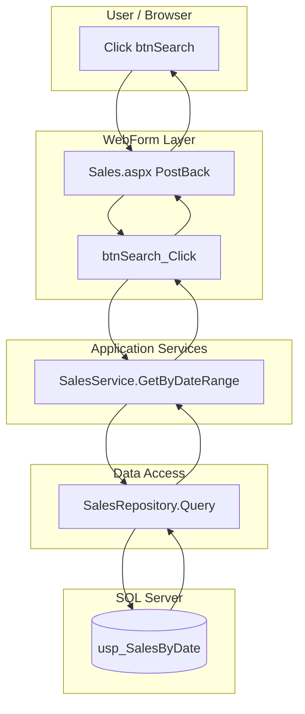
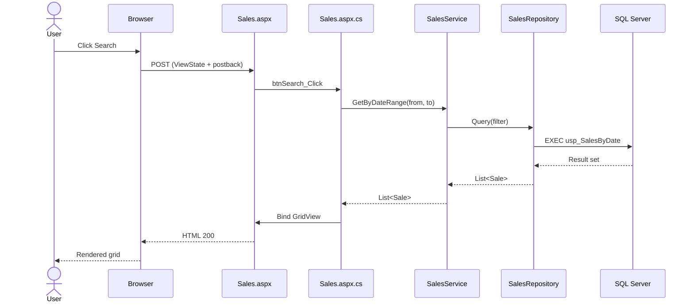
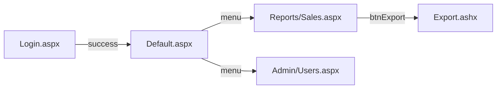
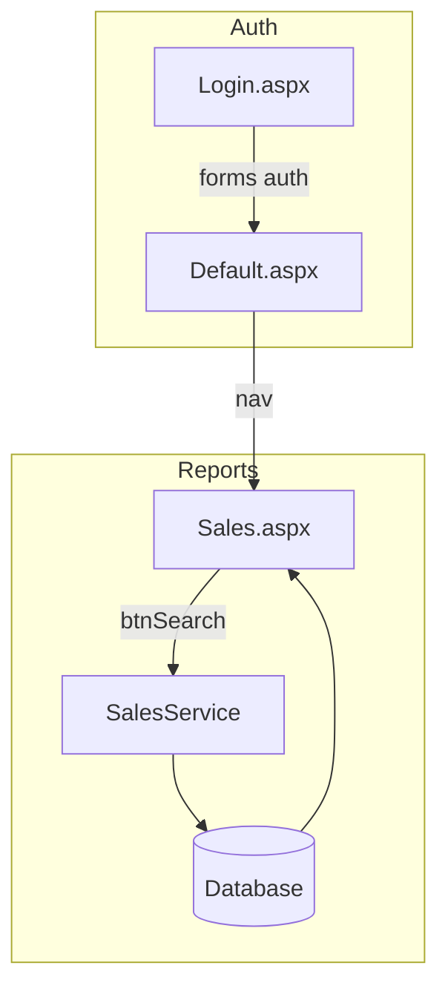
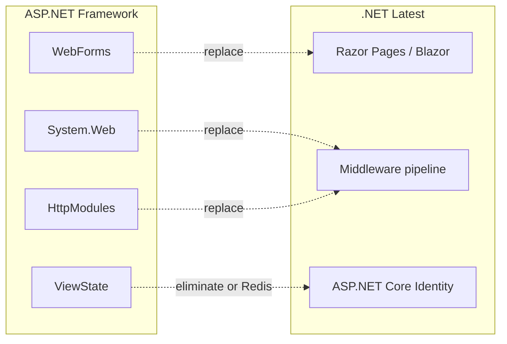

# Diagram Templates

Use Mermaid in deliverables. Create during Phase 5 (Synthesis).

## Swimlane Diagram

Map actors and layers from execution traces. One swimlane per logical layer.

### Template



### Swimlane identification checklist

From traces, extract:

- [ ] **User** — all UI triggers
- [ ] **Presentation** — .aspx, .ascx, master pages, MVC views
- [ ] **Application** — code-behind handlers, controllers
- [ ] **Cross-cutting** — modules, filters, auth, logging
- [ ] **Domain/Services** — BLL, managers, validators
- [ ] **Data** — repositories, EF contexts, ADO.NET
- [ ] **External** — SOAP, REST, file system, SMTP, queue
- [ ] **Database** — tables, stored procs

### When to create swimlanes

| Flow type | Priority |
|-----------|----------|
| Authentication / session | High |
| Multi-step business process | High |
| Payment / submission | High |
| CRUD with validation | Medium |
| Simple read-only page | Low (skip unless migration-critical) |

## Sequence Diagram

Use for High-priority flows. Show temporal order and return messages.

### Template



### Sequence diagram catalog entry

```markdown
### SEQ-001: Sales search
- **Priority:** High
- **Entry:** Reports/Sales.aspx
- **Trigger:** btnSearch_Click
- **Actors:** User, Sales.aspx, SalesService, SalesRepository, SQL
- **Why diagram:** Core reporting path, ViewState postback, stored proc
- **Migration note:** Candidate for Razor Page + minimal API
```

## Navigation Graph

Separate from swimlanes — shows page-to-page movement only.



## Interaction Map (global)

Combine navigation + traces in one view for critical paths.



## Cross-cutting concerns diagram

For migration planning — show System.Web dependencies.



## Diagram Pack Deliverable

Include in final output:

1. Navigation graph (site-wide)
2. 1 swimlane per High-priority domain (auth, core CRUD, integrations)
3. 1 sequence diagram per High-priority interaction trace
4. Cross-cutting migration diagram (current → target)
