# OverGoods (OGS) — Routing / Navigation Map

 

## How routing works

This is a classic **ASP.NET WebForms** app (`Overgoods_SSO`). There is **no custom

route table** — no `MapPageRoute`, `RouteConfig`, or MVC/attribute routing.

`Global.asax` only declares `Inherits="Overgoods.Global"` and `App_Code/global.asax.cs`

contains no route registration.

 

Routing is therefore **physical `.aspx` file paths**. Navigation between pages happens via:

- `<a href="...aspx">` links in the master page and the menu/hub pages

- `Response.Redirect(...)` / `PostBackUrl` in code-behind (e.g. login flow)

- `*.asmx` web-service endpoints (registered as httpHandlers in `web.config`)

 

Entry point after auth is `login.aspx` → `default.aspx` (subsidiary picker) → `mainmenu.aspx`.

```mermaid

flowchart TD

    SSO[AzureSSOLoginPage.aspx] --> LOGIN[login.aspx]

    AUTH[auth.aspx] --> LOGIN

    LOGIN -->|no profile| PNF[ProfileNotFound.aspx]

    LOGIN -->|SCS user| SEARCH

    LOGIN --> DEFAULT[default.aspx - Subsidiaries]

    DEFAULT --> MAIN[mainmenu.aspx - MAIN MENU]

    MASTER[MasterPage.master] -.MAIN MENU / LOGOUT.-> MAIN

    MASTER -.LOGOUT.-> LOGIN

 

    %% ---- Main menu groups ----

    MAIN --> DE[dataentry.aspx]

    MAIN --> SEARCH[search.aspx]

    MAIN --> REPORTS[reports.aspx]

    MAIN --> UM[usermanagement/default.aspx]

    MAIN --> WH[WarehouseMenu.aspx]

    MAIN --> TOOLS[toolsmenu.aspx]

 

    %% ---- Data Entry ----

    DE --> unknownovergoods.aspx

    DE --> knowngoods.aspx

    DE --> WweMiOrphans.aspx

    DE --> CarrierKnowngoods.aspx

    DE --> sensitivematerial.aspx

    DE --> AbandonedOvergoods.aspx

    DE --> NonTransportingGoods.aspx

    DE --> hazmat.aspx

    DE --> guns.aspx

    DE --> scssalvage.aspx

 

    %% ---- Search ----

    SEARCH --> searchresults.aspx

    SEARCH --> AdminSearch.aspx

    SEARCH --> eTTPostback.aspx

 

    %% ---- User Management ----

    UM --> um_new[usermanagement/NewUser.aspx]

    UM --> um_sel[usermanagement/selectuser.aspx]

    UM --> um_del[usermanagement/deleteuser.aspx]

    UM --> um_perm[usermanagement/pagepermissions.aspx]

 

    %% ---- Warehouse Ops ----

    WH --> HotListCandidate.aspx

    WH --> LTRReceive.aspx

    WH --> DispositionInventory.aspx

    WH --> AttachPhoto.aspx

    WH --> ListInventory.aspx

    WH --> QualityAudit.aspx

    WH --> OverageDataEntry.aspx

    WH --> InventoryActivity.aspx

    WH --> PrintTickets.aspx

 

    %% ---- Tools ----

    TOOLS --> HotListDataCapture.aspx

    TOOLS --> UpdateLocations.aspx

    TOOLS --> AddTrackingNumbers.aspx

    TOOLS --> ReverseVoid.aspx

    TOOLS --> FinalStatusTool.aspx

    TOOLS --> WarehouseAdd.aspx

    TOOLS --> WarehouseAlignment.aspx

    TOOLS --> synonymsearch.aspx

    TOOLS --> PrintLetters.aspx

    TOOLS --> KnownBlockedAccounts.aspx

    TOOLS --> CitibankPilotMaintenance.aspx

    TOOLS --> DeleteOvergoods.aspx

 

    %% ---- Reports (reports/ subfolder) ----

    REPORTS --> r_wh[reports/warehousereport.aspx]

    REPORTS --> r_whp[reports/WHPerfReport.aspx]

    REPORTS --> r_isp[reports/AbandonISP.aspx]

    REPORTS --> r_void[reports/VoidConcillationReport.aspx]

    REPORTS --> r_cust[reports/CustomerReturnsReport.aspx]

    REPORTS --> r_eu[reports/EULiquidationReport.aspx]

    REPORTS --> r_fs[reports/FinalStatusReport.aspx]

    REPORTS --> r_frec[reports/FreightReceivedReport.aspx]

    REPORTS --> r_fops[reports/FreightOperationsReport.aspx]

    REPORTS --> r_foi[reports/FreightOpenInventoryReport.aspx]

    REPORTS --> r_ftv[reports/FreightTotalValueOverageReport.aspx]

    REPORTS --> r_exd[reports/ExceptionDetails.aspx]

    REPORTS --> r_exs[reports/ExceptionSummary.aspx]

    REPORTS --> r_og[reports/overgoodreport.aspx]

    REPORTS --> r_adv[reports/advovergoodreport.aspx]

    REPORTS --> r_wip[reports/WIPReport.aspx]

    REPORTS --> r_photo[reports/PhotoReport.aspx]

    REPORTS --> r_mat[reports/MaturedItemsReport.aspx]

    REPORTS --> r_fmat[reports/FreightMaturedItemsReport.aspx]

    REPORTS --> r_whex[reports/WarehouseExceptions.aspx]

    REPORTS --> r_ogsum[reports/OvergoodSummaryReport.aspx]

    REPORTS --> r_del[reports/DeletedIncidentReport.aspx]

    REPORTS --> r_wwed[reports/WWEDetails.aspx]

    REPORTS --> r_wwes[reports/WWESummary.aspx]

    REPORTS --> r_known[reports/KnownOvergoodsWeeklyExtract.aspx]

    REPORTS --> r_data[reports/datareport.aspx?reporttype=...]

    REPORTS -.exports.-> r_csv[reports/downloadcsv.aspx]

    REPORTS -.exports.-> r_rtf[reports/downloadrtf.aspx]

 

    %% ---- Web services (asmx httpHandlers) ----

    SVC1[OGSService.asmx]:::svc

    SVC2[ProductCodeProcessor.asmx]:::svc

 

    classDef svc fill:#eef,stroke:#66c;

```

 

 

## Web-service endpoints (from web.config httpHandlers, `*.asmx`)

- `OGSService.asmx`

- `ProductCodeProcessor.asmx`

 

## Standalone / not menu-linked pages (reached by redirect or direct URL)

`Image.aspx`, `InventoryPhoto.aspx`, `photos.aspx`, `ItemDetails.aspx`,

`Address.aspx`, `UpdateReturnInfo.aspx`, `UpcLookup.aspx`, `AddTrackingNumbers.aspx`,

`ListerHistory.aspx`, `LettersHistory.aspx`, `PickTicketHistory.aspx`,

`ViewAllKeyWord.aspx`, `Exceptions.aspx`, `Firearms.aspx`, `hazmat-us/ca/eu.aspx`,

`guns-ca/eu.aspx`, `unknowngoods.aspx`, `ReverseVoid.aspx`, `WebServiceTest.aspx`,

`ErrorPage.aspx`, `ErrorInvalidInput.aspx`, `ProfileNotFound.aspx`, `Firearms`, etc.