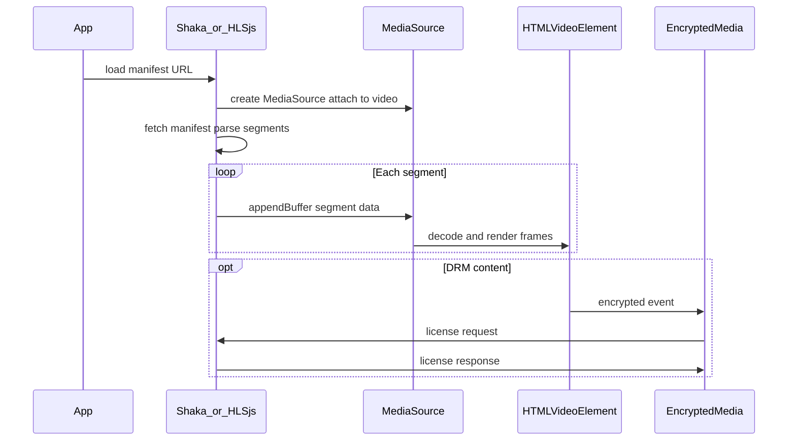

# HTML5 Video, MSE & EME

## What it is

The HTML5 `<video>` element plays media in the browser. **MSE (Media Source Extensions)** lets JavaScript feed fragmented media segments into a `MediaSource` object for adaptive streaming. **EME (Encrypted Media Extensions)** handles DRM license exchange so encrypted segments can be decrypted and played. Every modern player SDK (Shaka, HLS.js) sits on top of these browser APIs.

## Why it matters for this role

The job explicitly requires integrating player UI with HTML5, MSE, and EME. You cannot customize buffering, ABR, or DRM behavior without understanding what happens below the SDK layer. Production debugging (triaging rebuffering, license failures) requires reading `video.error` codes and MSE `SourceBuffer` states.

## Core concepts checklist

- [ ] `<video>` attributes: `src`, `controls`, `autoplay`, `muted`, `playsInline`, `crossOrigin`
- [ ] Media events: `loadstart`, `loadedmetadata`, `canplay`, `playing`, `waiting`, `stalled`, `error`, `ended`
- [ ] `HTMLMediaElement` properties: `currentTime`, `duration`, `buffered`, `readyState`, `networkState`
- [ ] `MediaError` codes: `MEDIA_ERR_ABORTED (1)`, `MEDIA_ERR_NETWORK (2)`, `MEDIA_ERR_DECODE (3)`, `MEDIA_ERR_SRC_NOT_SUPPORTED (4)`
- [ ] `MediaSource` API: `addSourceBuffer()`, `appendBuffer()`, `endOfStream()`
- [ ] Codec strings: `'video/mp4; codecs="avc1.42E01E, mp4a.40.2"'` (avc1 = H.264, mp4a = AAC)
- [ ] `SourceBuffer` modes: `segments` vs `sequence`
- [ ] `updateend` event — never append until previous append completes
- [ ] EME flow: `requestMediaKeySystemAccess` → `createMediaKeys` → `createSession` → license request/response
- [ ] `encrypted` event on video element triggers license exchange
- [ ] CORS requirement for cross-origin media segments (`crossOrigin="anonymous"`)

## Media pipeline (conceptual)

## Learning resources

| Resource | Type | URL |
|----------|------|-----|
| MDN — HTMLVideoElement | Reference | https://developer.mozilla.org/en-US/docs/Web/API/HTMLVideoElement |
| MDN — Media Source Extensions | Reference | https://developer.mozilla.org/en-US/docs/Web/API/Media_Source_Extensions_API |
| MDN — Encrypted Media Extensions | Reference | https://developer.mozilla.org/en-US/docs/Web/API/Encrypted_Media_Extensions_API |
| MSE draft spec | Spec | https://w3c.github.io/media-source/ |
| EME draft spec | Spec | https://w3c.github.io/encrypted-media/ |
| Google's Shaka Player docs (MSE internals) | Guide | https://shaka-player-demo.appspot.com/docs/api/tutorial-welcome.html |
| HTTP Live Streaming (conceptual bridge to HLS) | Apple | https://developer.apple.com/streaming/ |

## Hands-on exercises

1. **Basic video:** Load an MP4 in `<video>`; log all media events to console; display `readyState` and `networkState` on screen.
2. **Buffered ranges:** Visualize `video.buffered` TimeRanges on a canvas or div alongside currentTime.
3. **Raw MSE:** Append fMP4 segments manually to a `MediaSource` (use a known-good fragmented MP4 sample).
4. **Error handling:** Deliberately load a bad URL; map `video.error.code` to user-friendly messages.
5. **EME diagram:** Draw the license request/response flow for Widevine; identify where Shaka intercepts each step.

## Interview / on-the-job topics

- Difference between progressive download (MP4 `src`) and adaptive streaming (MSE)
- Why `waiting` and `stalled` events matter for rebuffer metrics
- What causes `QuotaExceededError` on SourceBuffer (memory/buffer limits)
- How EME key rotation works during long playback sessions
- Safari native HLS vs MSE path — when HLS.js is needed vs native

## Related skills

- [hls-dash-protocols.md](hls-dash-protocols.md) — Manifest formats fed into MSE
- [video-player-sdks.md](video-player-sdks.md) — SDKs abstracting MSE/EME
- [web-security-streaming.md](web-security-streaming.md) — CORS and crossOrigin for media
- [performance-qos-analytics.md](performance-qos-analytics.md) — Startup time, rebuffer events
